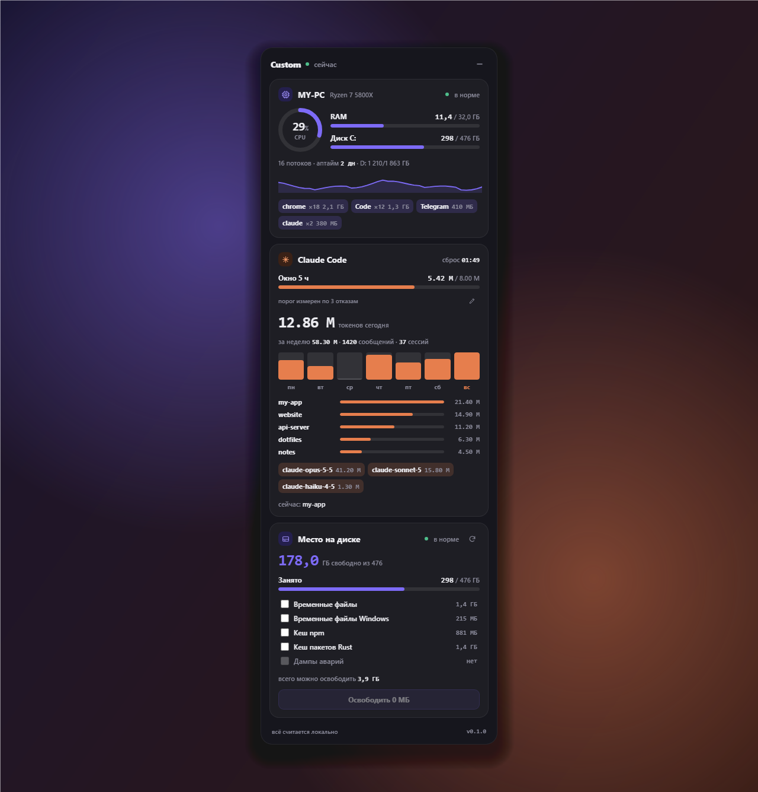

<div align="center">


# Custom

**Компактный десктоп-виджет для Windows: состояние ПК, расход токенов Claude Code и место на диске на одной тёмной панели поверх остальных окон.**

[](https://github.com/TimohaKodit/Custom/releases)
[](#-установка)
[](https://tauri.app)
[](https://www.rust-lang.org)
[](https://react.dev)

[Скачать](https://github.com/TimohaKodit/Custom/releases) · [Возможности](#-возможности) · [Сборка](#-сборка-из-исходников) · [Планы](#-планы)

<br />



</div>

<br />

## ✨ Возможности

<table>
<tr>
<td width="33%" valign="top">

### 🖥️ Этот ПК

- Кольцо загрузки **CPU**
- Полосы **RAM** и системного диска
- Остальные диски и **аптайм**
- **Спарклайн** нагрузки в реальном времени
- **Топ процессов** по памяти, одинаковые процессы сгруппированы

</td>
<td width="33%" valign="top">

### ✳️ Claude Code

- Токены за **5-часовое окно** и время сброса
- Итоги за **день** и за **неделю**
- Столбики по **дням недели**
- Разбивка по **проектам** и **моделям**
- Какие проекты открыты **сейчас**

</td>
<td width="33%" valign="top">

### 💾 Место на диске

- Сколько **свободно** на системном диске
- Размер **временных файлов**, кешей **npm** и **Rust**, дампов аварий
- Очистка выбранных пунктов **в один клик** с подтверждением

</td>
</tr>
</table>

## 🔒 Всё локально

Все цифры считаются на вашем компьютере. Своего сервера, интернета, аккаунта и API-ключей приложению не нужно.

Статистика Claude Code берётся из локальных логов `%USERPROFILE%\.claude\projects`. Эти файлы приложение только читает и никогда не изменяет. Повторяющиеся записи в логах отбрасываются, поэтому цифры не завышены.

## 📦 Установка

1. Откройте страницу [**Releases**](https://github.com/TimohaKodit/Custom/releases).
2. Скачайте `.msi` или `.exe` из последнего релиза.
3. Запустите установщик.

> [!NOTE]
> Приложение не подписано сертификатом разработчика: такой сертификат платный. Поэтому Windows SmartScreen покажет окно «Windows защитила ваш компьютер» с пометкой «Неизвестный издатель». Нажмите **«Подробнее»**, а затем **«Выполнить в любом случае»**. Так Windows реагирует на любую неподписанную программу.

## 🛠️ Сборка из исходников

<details>
<summary><b>Что нужно установить</b></summary>

<br />

| Инструмент | Версия | Как поставить |
|---|---|---|
| Node.js | 20+ | [nodejs.org](https://nodejs.org) |
| Rust | stable | `winget install Rustlang.Rustup`, toolchain `stable-x86_64-pc-windows-msvc` |
| Visual Studio Build Tools | 2022 | компонент «Разработка классических приложений на C++» |
| WebView2 | — | уже есть в Windows 10 и 11 |

</details>

```powershell
npm install

# запуск в режиме разработки
npm run tauri dev

# сборка установщиков (.msi и NSIS .exe)
npm run tauri build
```

Готовые установщики появятся в `src-tauri/target/release/bundle`. Первая сборка идёт долго, потому что Rust компилирует все зависимости с нуля.

Релизы собирает GitHub Actions: при пуше тега `v*` создаётся черновик релиза с `.msi` и `.exe`.

## 🧱 Как устроено

```
src/                 фронтенд: React + TypeScript + Vite
├─ cards/            карточки виджета (ПК, Claude Code, диск)
├─ components/       кольцо, полоса, спарклайн
└─ hooks/            опрос данных из Rust
src-tauri/src/       бэкенд на Rust
├─ system.rs         CPU, память, диски, процессы (sysinfo)
├─ claude.rs         разбор логов Claude Code
└─ disk.rs           подсчёт и очистка временных файлов и кешей
```

Каждая карточка — отдельный модуль: свой компонент на фронте и своя команда в Rust. Окно шириной 400 px, без рамки, с прозрачным фоном, висит поверх остальных окон.

## 🗺️ Планы

- [x] Карточка «Этот ПК»
- [x] Карточка «Claude Code»
- [x] Карточка «Место на диске»
- [ ] Иконка в трее и автозапуск при входе в Windows
- [ ] Окно настроек
- [ ] **Сценарии запуска**: одна кнопка открывает набор программ, например «Работа» или «Игры»
- [ ] Предупреждение перед лимитом Claude и прогноз по скорости расхода
- [ ] Горячая клавиша «показать/скрыть» и компактный режим

<div align="center">
<br />
<sub>Версия 0.1.0 · проект в разработке</sub>
</div>
